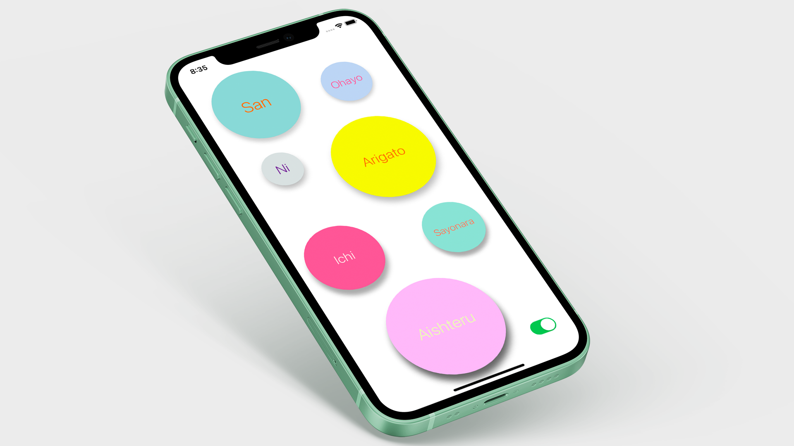

## Checklist
[Checklist](https://github.com/McHutov/iOS-Portfolio/tree/master/iOS-Projects/Cheaklists) is an iOS app made using **UIKit** 

Since "Todo list" is the most common program, I decided to choose it. Since this application helps to understand well the work of the TableView. But since everyone is tired of the usual "Todo list", I decided to add a few features. Such as: using UserDefaults to save the last page, notifications etc.

##### 🔨Technologies: UIKit, Notifications, UserDefaults, No third party libraries.
##### 🚀Platform: 📱iOS

## BullsEye
[BullsEye](https://github.com/McHutov/iOS-Portfolio/tree/master/iOS-Projects/BullsEye) is an iOS app where I was trying to do something like a game.

As soon as we start the application, a random value is generated, we must use the slider to find the approximate location of this value. The smaller the difference, the more points you earn. 

##### 🔨Technologies: UIKit, AVFoundation, No third party libraries.
##### 🚀Platform: 📱iOS

## VoicePlay
[VoicePlay](https://github.com/McHutov/iOS-Portfolio/tree/master/iOS-Projects/VoicePlay) is an iOS app where I tried to use **AVFoundation** to play MP3.

This was my first app where I tried to use the basics of the AVFoundation library. The main task of the application is to play popular Japanese phrases. In order not to look poor, I decided to add female and male voices. You can switch between voices in the lower right corner. 

##### 🔨Technologies: UIKit, AVFoundation, No third party libraries.
##### 🚀Platform: 📱iOS

## VendingMachine 
[VendingMachine](hhttps://github.com/McHutov/iOS-Portfolio/tree/master/iOS-Projects/Vending-Machine) is an iOS app to simulate a randomizer.

This application simulates throwing dice, if 3 identical ones are drawn, then you will receive a prize. The main goal was to learn how to use **UIImage**, **Array** and **Randomizer**.

##### 🔨Technologies: UIKit.
##### 🚀Platform: 📱iOS

