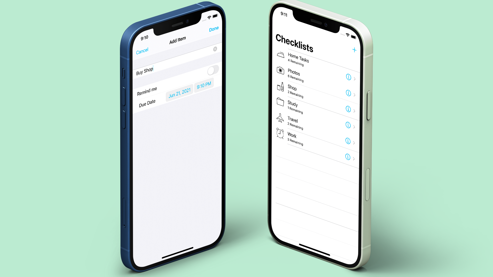

## Checklist
[Checklist](https://github.com/McHutov/iOS-Portfolio/tree/master/iOS-Projects/Cheaklists) is an iOS app made using **UIKit** 

Since "Todo list" is the most common program, I decided to choose it. Since this application helps to understand well the work of the TableView. But since everyone is tired of the usual "Todo list", I decided to add a few features. Such as: using UserDefaults to save the last page, notifications etc.

##### 🔨Technologies: UIKit, Notifications, UserDefaults, No third party libraries.
##### 🚀Platform: 📱iOS

